<div align="center" >
  
# 🚀 CareerGenie
  
### AI-Powered Career Guidance Platform

Helping students become industry-ready through AI-powered learning, personalized career roadmaps, mock interviews, resume intelligence, and career guidance.

<br>


</div>

---
## 🌐 Live Demo

🚀 **Frontend:** https://career-genie-wine.vercel.app/

⚙️ **Backend API:** https://career-genie-backend-gf7z.onrender.com/

---

# 📖 About CareerGenie

CareerGenie is an AI-powered career guidance platform designed to help students become industry-ready by providing personalized learning experiences and intelligent career support. The platform analyzes users' skills, identifies knowledge gaps, generates customized learning roadmaps, conducts AI-powered mock interviews, recommends projects, analyzes resumes, generates ATS-friendly resume bullet points, and offers real-time career assistance through Google Gemini AI.

Whether you're preparing for placements, improving your technical skills, or planning your career path, CareerGenie acts as your personal AI mentor throughout the journey.

---

# ✨ Key Features

## 🔐 Secure Authentication

- User Registration & Login
- JWT Authentication
- Password Encryption using Flask-Bcrypt
- Secure Protected APIs

---

## 📊 AI Skill Gap Analysis

Analyze your current skills against industry requirements.

### Features

- Skill comparison
- Missing skills detection
- Career readiness score
- Personalized recommendations
- Industry-based evaluation

---

## 🗺 AI Career Roadmap

Generate a personalized learning roadmap based on your target career.

### Features

- AI-generated roadmap
- Weekly learning plan
- Learning milestones
- Progress tracking
- Recommended resources

---

## 🤖 AI Career Assistant

Your personal AI mentor powered by Google Gemini.

### Features

- Career guidance
- Technical doubt solving
- Learning recommendations
- Industry insights
- Real-time conversations

---

## 🎤 AI Mock Interview

Practice interviews with an AI interviewer using voice interaction.

### Features

- AI-generated interview questions
- Voice interaction
- Speech Recognition
- Interview conversation
- AI Interview Report

---

## 📝 Skill Assessment Quiz

Evaluate your knowledge through AI-driven assessments.

### Features

- Multiple-choice questions
- Instant evaluation
- Score calculation
- Skill assessment
- Performance feedback

---

## 💼 AI Project Recommender

Receive project ideas tailored to your career goal.

### Features

- Personalized recommendations
- Difficulty level
- Required technologies
- Learning outcomes
- Project descriptions

---

## ✍ AI Resume Bullet Generator

Generate ATS-friendly resume bullet points instantly.

### Features

- AI-generated bullet points
- Professional language
- Action-oriented content
- Resume enhancement

---

## 📄 AI Resume Analyzer

Upload your resume and receive intelligent analysis.

### Features

- PDF Support
- DOCX Support
- Resume parsing
- Skill extraction
- Resume improvement suggestions

---

## 🏅 Certificate Management

Manage and organize your certifications.

### Features

- Upload certificates
- View certificates
- Track achievements
- Learning portfolio

---

## 🚫 Custom 404 Page

A beautifully designed responsive page for invalid routes.

---

# 🛠 Tech Stack

| Category | Technologies |
|-----------|--------------|
| Frontend | React.js, JavaScript, CSS3, Framer Motion |
| Backend | Flask, Python |
| Database | PostgreSQL (Neon) |
| ORM | SQLAlchemy |
| Authentication | JWT, Flask-Bcrypt |
| AI Model | Google Gemini 3.1 Flash Lite|
| AI API | Google GenAI API |
| Resume Parsing | PyMuPDF (fitz), python-docx |
| Deployment | Vercel, Render |
| Version Control | Git & GitHub |

---

# 🧠 AI Capabilities

CareerGenie integrates Google Gemini AI to provide intelligent and personalized career assistance.

The AI powers the following modules:

- 🤖 AI Career Assistant
- 🗺 AI Career Roadmap Generation
- 🎤 AI Mock Interview
- 📊 Interview Performance Analysis
- ✍ Resume Bullet Generator
- 💼 Project Recommendation Engine

---

# 📸 Application Preview

Below are some screenshots of CareerGenie.

## 🏠 Landing Page

<p align="center">
  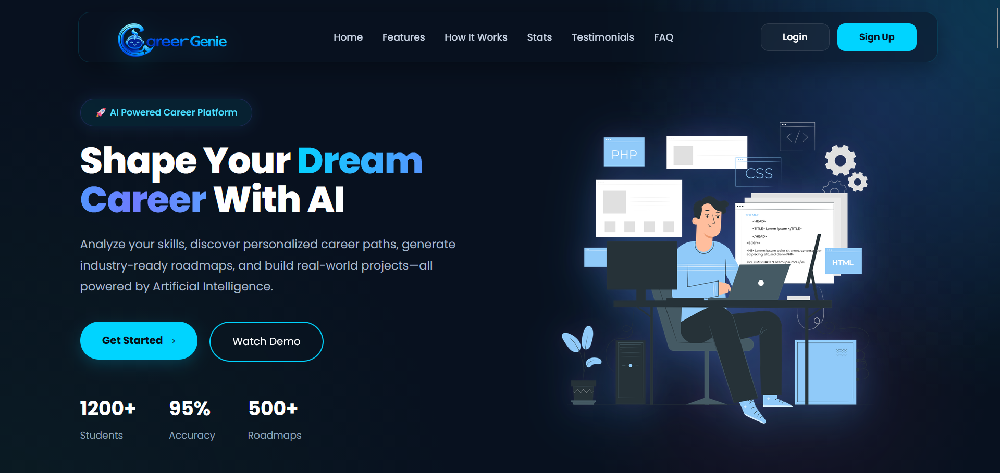
</p>

---

<p align="center">
  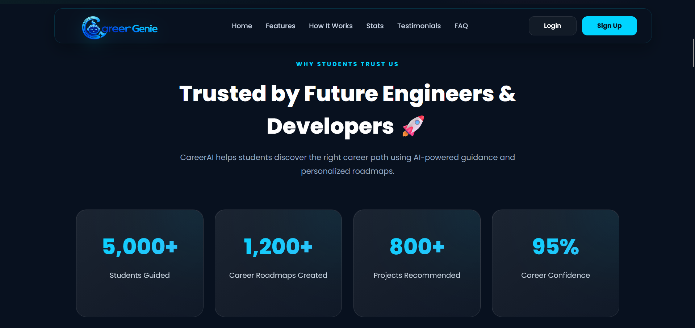
</p>

---
<p align="center">
  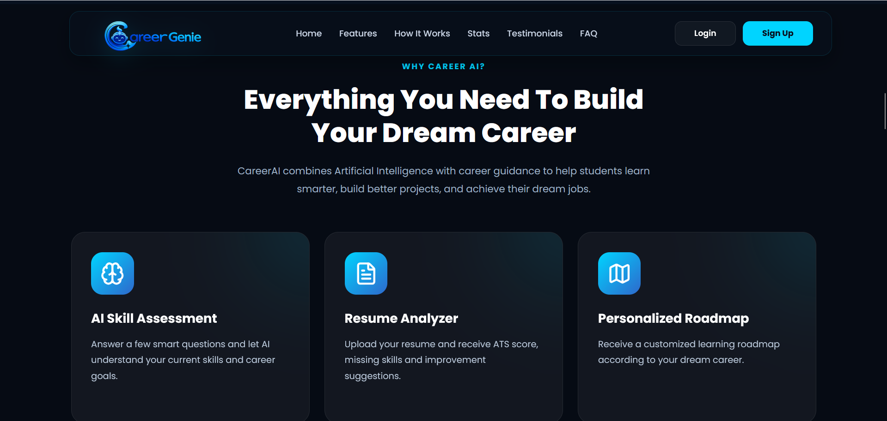
</p>

---
<p align="center">
  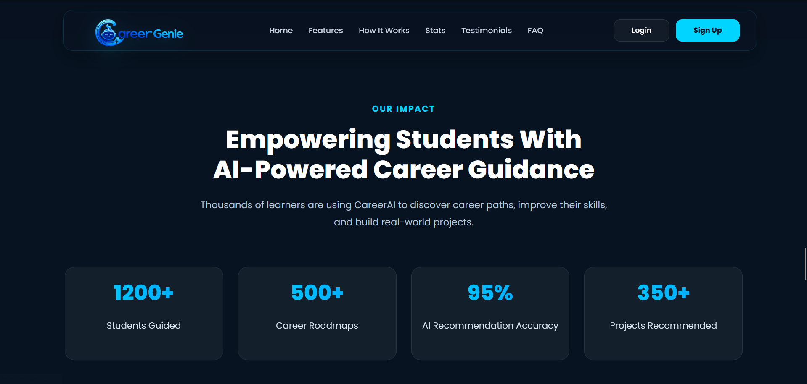
</p>

---

## 🔑 Login & 🔓 Signup

<p align="center">
  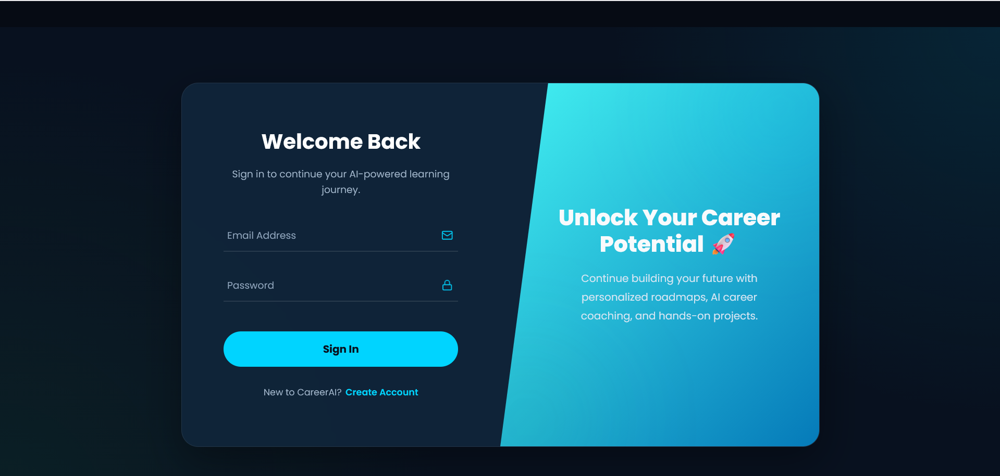
</p>

---

<p align="center">
  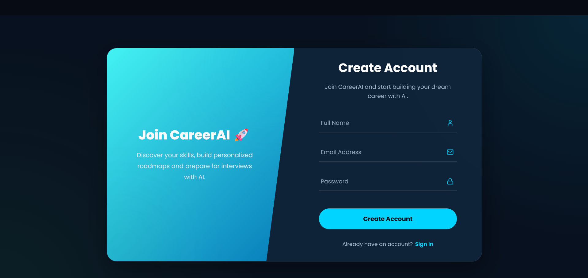
</p>

---

## 📊 Dashboard

<p align="center">
  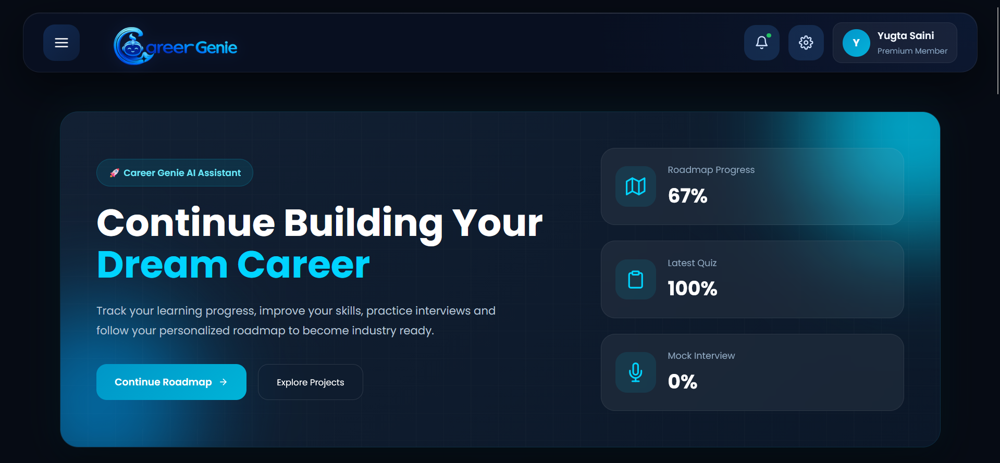
</p>

---

<p align="center">
  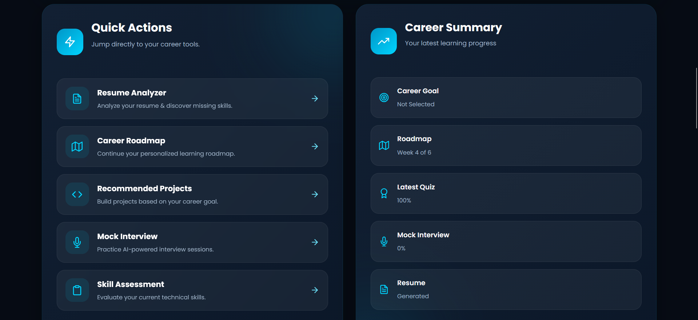
</p>

---

## 📈 Skill Gap Analysis

<p align="center">
  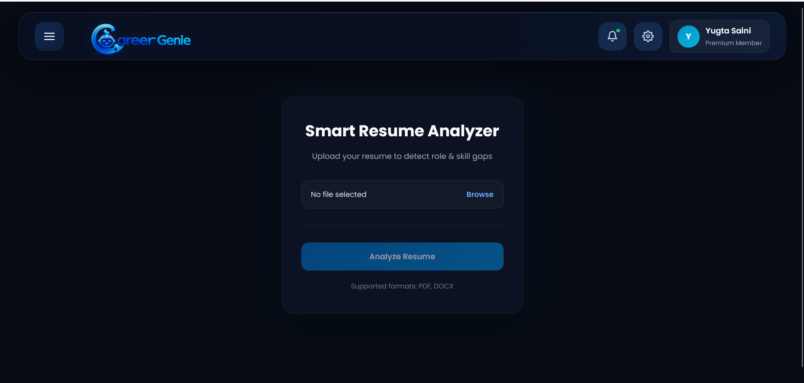
</p>

---

## 🗺️ Career Roadmap

<p align="center">
  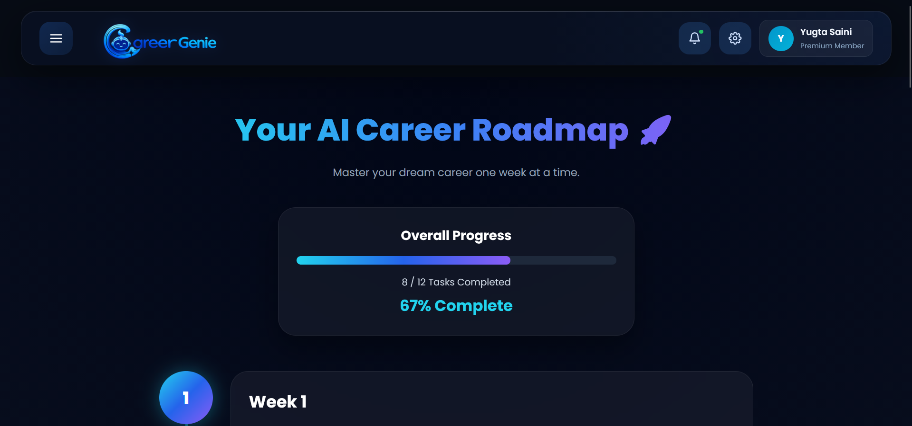
</p>

---

## 🤖 AI Career Assistant

<p align="center">
  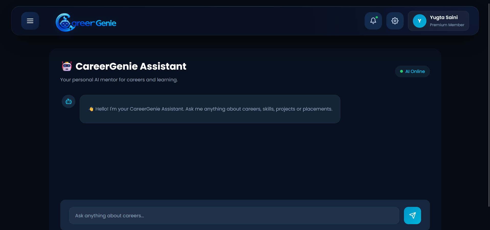
</p>

---

## 🎤 AI Mock Interview

<p align="center">
  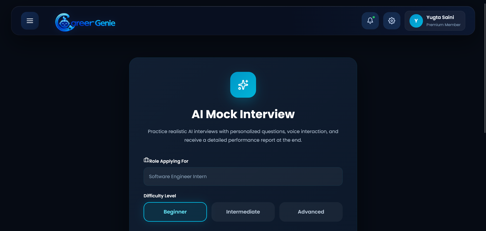
</p>

---

## 📄 Skill Assessment

<p align="center">
  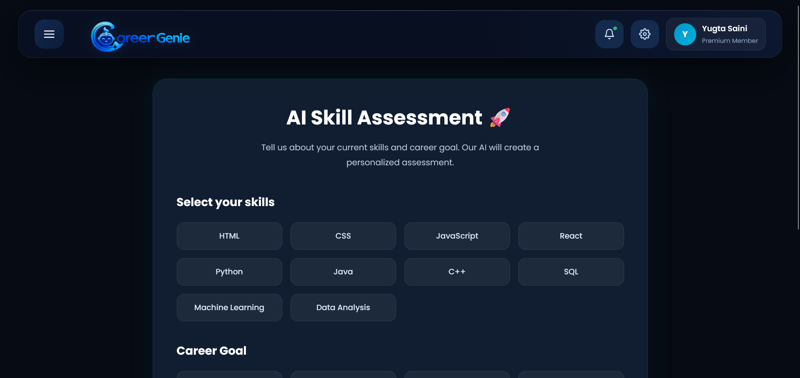
</p>

---

## ✍️ Resume Bullet Generator

<p align="center">
  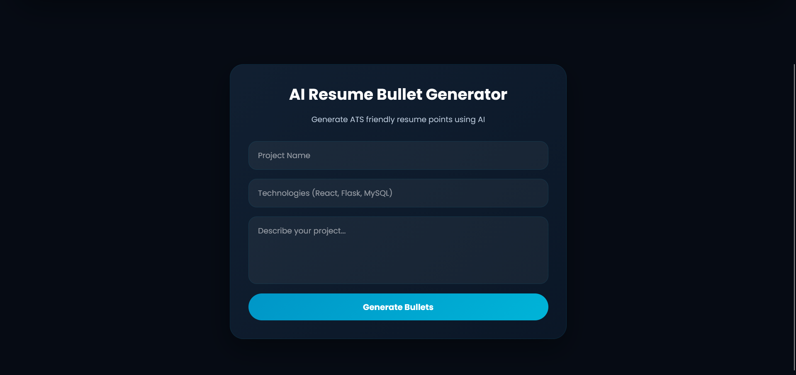
</p>

---

## 💼 Project Recommender

<p align="center">
  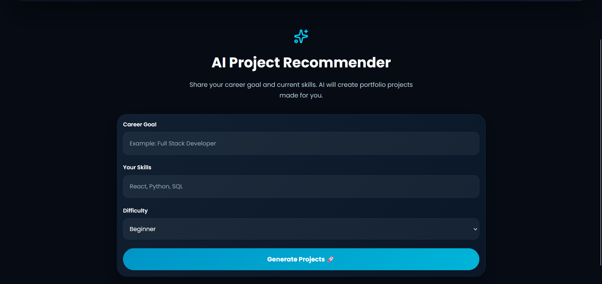
</p>

---

## 🏅 Certificate Management

<p align="center">
  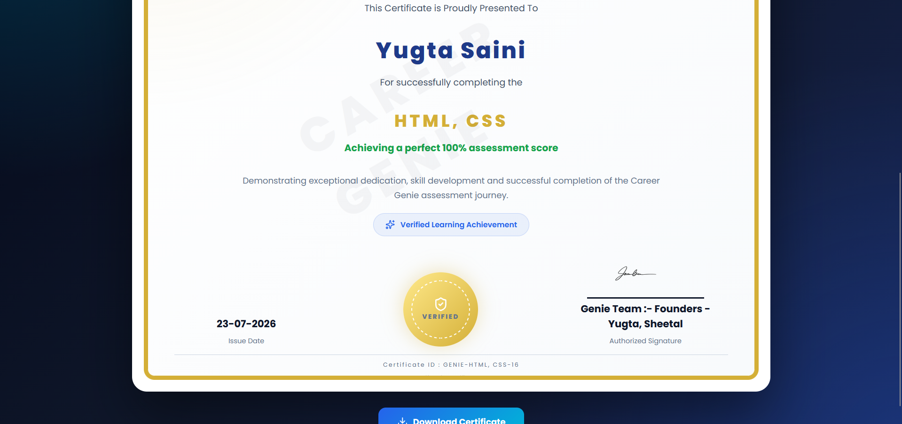
</p>

---

## ❌ 404 Not Found Page

<p align="center">
  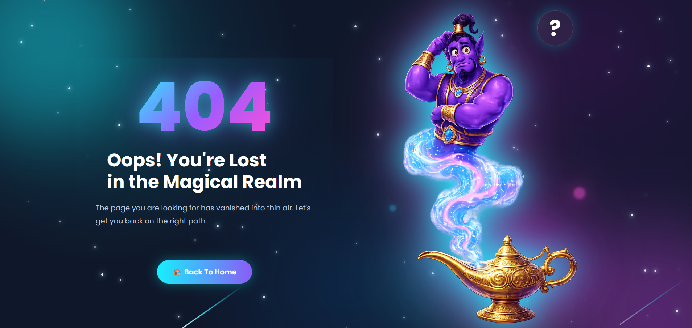
</p>

---

# 🏗️ System Architecture

```text
                    +----------------------+
                    |      React.js        |
                    |   Frontend (Vercel)  |
                    +----------+-----------+
                               |
                               |
                         REST API Calls
                               |
                               ▼
                    +----------------------+
                    |     Flask Backend    |
                    |      (Render)        |
                    +----------+-----------+
                               |
          +--------------------+--------------------+
          |                    |                    |
          ▼                    ▼                    ▼
+----------------+    +----------------+    +----------------+
| Google Gemini  |    | PostgreSQL DB  |    | Authentication |
|     API        |    |     (Neon)     |    | JWT + Bcrypt   |
+----------------+    +----------------+    +----------------+
```

---

# 📂 Project Structure

```text
CareerGenie
│
├── backend
│   ├── app
│   │   ├── models
│   │   ├── routes
│   │   ├── services
│   │   ├── utils
│   │   ├── config.py
│   │   └── __init__.py
│   │
│   ├── requirements.txt
│   ├── run.py
│   └── .env
│
├── frontend
│   ├── public
│   ├── src
│   │   ├── assets
│   │   ├── components
│   │   ├── layouts
│   │   ├── pages
│   │   ├── styles
│   │   ├── App.jsx
│   │   └── index.js
│   │
│   ├── package.json
│   └── .env
│
└── README.md
```

---

# ⚙️ Installation

## Clone Repository

```bash
git clone https://github.com/yugtasaini624/CareerGenie.git
```

```bash
cd CareerGenie
```

---

# Backend Setup

```bash
cd backend
```

Install dependencies

```bash
pip install -r requirements.txt
```

Run Backend

```bash
python run.py
```

---

# Frontend Setup

```bash
cd frontend
```

Install dependencies

```bash
npm install
```

Run Frontend

```bash
npm start
```

---

# 🔑 Environment Variables

## Backend (.env)

```env
SECRET_KEY=your_secret_key

JWT_SECRET_KEY=your_jwt_secret

DATABASE_URL=your_neon_database_url

GEMINI_API_KEY=your_google_gemini_api_key
```

---

# 🌐 API Endpoints

| Module | Endpoint |
|---------|----------|
| Authentication | `/api/auth/*` |
| Skill Gap Analysis | `/api/skill-gap` |
| Career Roadmap | `/api/roadmap` |
| AI Chatbot | `/api/chat` |
| Mock Interview | `/api/interview` |
| Resume Analyzer | `/api/resume` |
| Resume Bullet Generator | `/api/resume-bullets` |
| Project Recommender | `/api/projects` |
| Skill Quiz | `/api/quiz` |
| Dashboard | `/api/dashboard` |
| Certificates | `/api/certificates` |

---

# 🤖 AI Features

CareerGenie uses **Google Gemini 3.1 Flash Lite** to provide intelligent career guidance and automation.

### AI is used for

- Personalized Career Roadmap Generation
- AI Career Assistant
- Voice-based Mock Interview
- Interview Report Generation
- Resume Bullet Generation
- Project Recommendation
- Personalized Career Guidance

---

# 📊 Database

The application stores all user-related information inside PostgreSQL.

### Database includes

- User Profiles
- Career Roles
- Skill Gap Reports
- Career Roadmaps
- Weekly Tasks
- Interview Sessions
- Interview Reports
- Quiz Sessions
- Resume Bullet History
- Certificates
- Project Recommendations

---

# 🔒 Security

CareerGenie follows several security practices.

- JWT Authentication
- Password Hashing using Flask-Bcrypt
- Protected API Routes
- Secure PostgreSQL Connection
- Environment Variables
- CORS Configuration

---

# 🚀 Deployment

### Frontend

- Vercel

### Backend

- Render

### Database

- Neon PostgreSQL

### AI

- Google Gemini API

---

# 📈 Future Improvements

- AI Coding Interview
- Company-specific Interview Preparation
- Job Recommendation System
- AI Learning Analytics
- Daily Learning Reminder
- Dark & Light Theme
- Multi-language Support
- Mobile Application
- Admin Dashboard

---

# 🤝 Contributing

Contributions are always welcome.

If you'd like to improve CareerGenie, feel free to:

- Fork the repository
- Create a feature branch
- Commit your changes
- Push your branch
- Open a Pull Request

---
# 👨‍💻 Development Team

CareerGenie was collaboratively designed and developed as a full-stack AI-powered career guidance platform by:

### **Yugta Saini** & **Sheetal Kumari**

Computer Science Students passionate about Artificial Intelligence, Full-Stack Development, and building impactful solutions that help students become industry-ready.

### Connect with Us

#### Yugta Saini
- 💼 LinkedIn: https://www.linkedin.com/in/yugtasaini624/
- 💻 GitHub: https://github.com/yugtasaini624

#### Sheetal Kumari
- 💼 LinkedIn: https://www.linkedin.com/in/sheetal-kumaridev/
- 💻 GitHub: https://github.com/Sheetal-kumari

---

# ⭐ Support

If you found this project helpful or interesting, please consider giving it a ⭐ on GitHub. Your support encourages us to continue building impactful AI-powered applications.

---

# 📄 License

This project is developed for educational, learning, and portfolio purposes.

© 2026 CareerGenie. All Rights Reserved.
